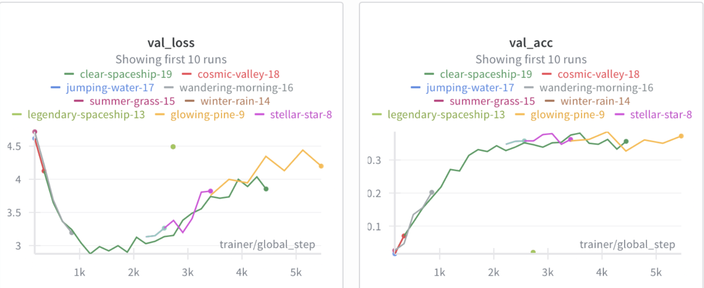
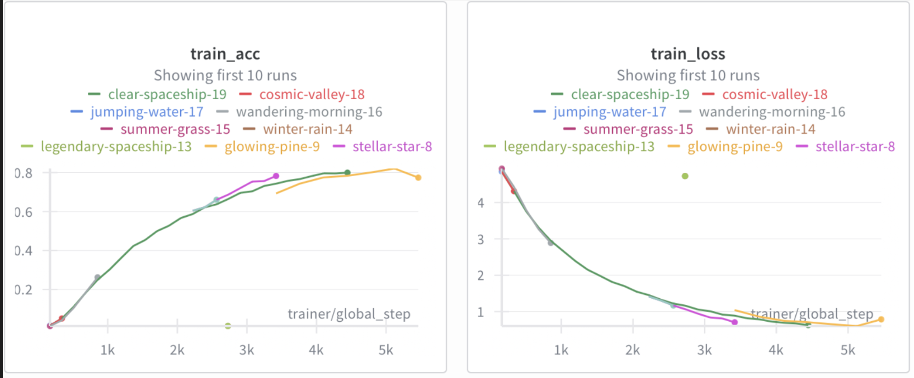
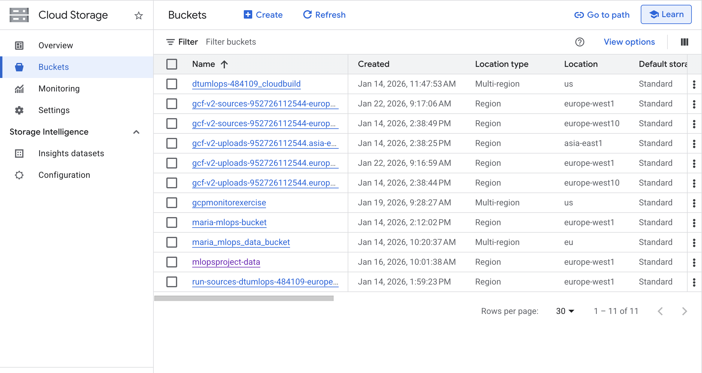
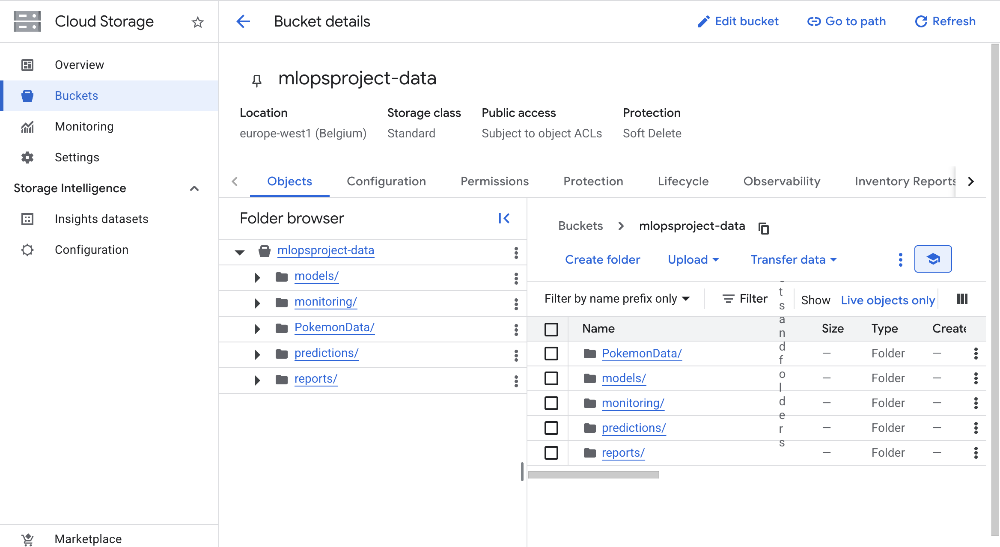
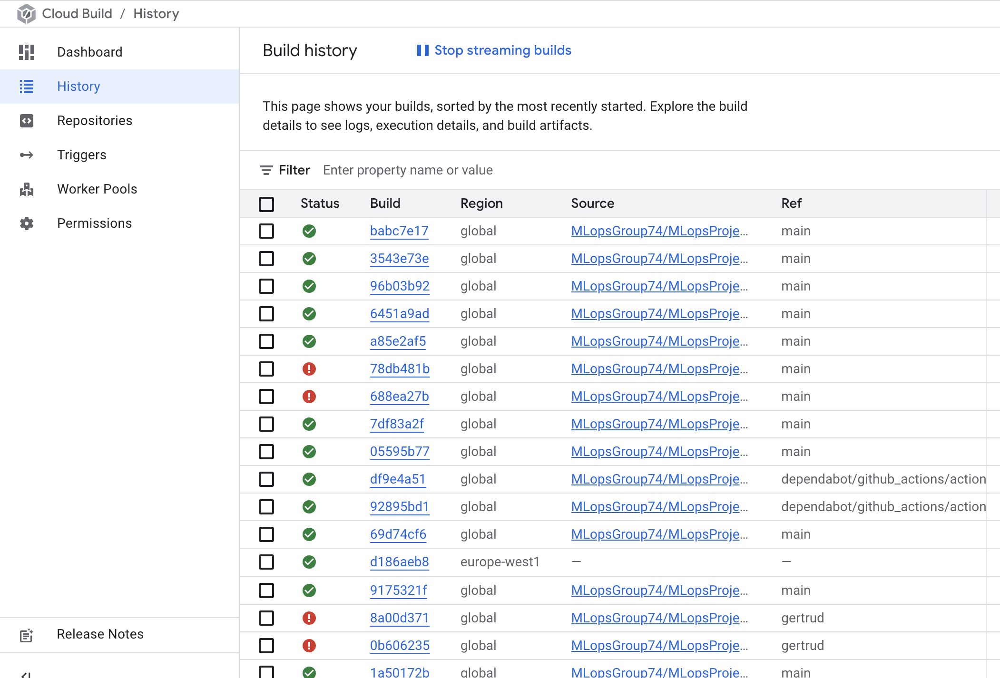
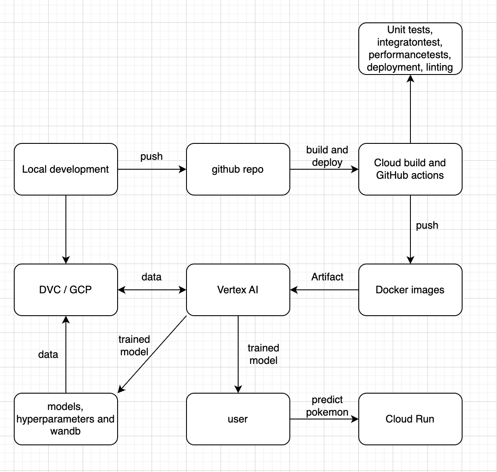

# Exam template for 02476 Machine Learning Operations

This is the report template for the exam. Please only remove the text formatted as with three dashes in front and behind
like:

```--- question 1 fill here ---```

Where you instead should add your answers. Any other changes may have unwanted consequences when your report is
auto-generated at the end of the course. For questions where you are asked to include images, start by adding the image
to the `figures` subfolder (please only use `.png`, `.jpg` or `.jpeg`) and then add the following code in your answer:

``

In addition to this markdown file, we also provide the `report.py` script that provides two utility functions:

Running:

```bash
python report.py html
```

Will generate a `.html` page of your report. After the deadline for answering this template, we will auto-scrape
everything in this `reports` folder and then use this utility to generate a `.html` page that will be your serve
as your final hand-in.

Running

```bash
python report.py check
```

Will check your answers in this template against the constraints listed for each question e.g. is your answer too
short, too long, or have you included an image when asked. For both functions to work you mustn't rename anything.
The script has two dependencies that can be installed with

```bash
pip install typer markdown
```

or

```bash
uv add typer markdown
```

## Overall project checklist

The checklist is *exhaustive* which means that it includes everything that you could do on the project included in the
curriculum in this course. Therefore, we do not expect at all that you have checked all boxes at the end of the project.
The parenthesis at the end indicates what module the bullet point is related to. Please be honest in your answers, we
will check the repositories and the code to verify your answers.

### Week 1

* [ x] Create a git repository (M5)
* [ x] Make sure that all team members have write access to the GitHub repository (M5)
* [x ] Create a dedicated environment for you project to keep track of your packages (M2)
* [x ] Create the initial file structure using cookiecutter with an appropriate template (M6)
* [x ] Fill out the `data.py` file such that it downloads whatever data you need and preprocesses it (if necessary) (M6)
* [x ] Add a model to `model.py` and a training procedure to `train.py` and get that running (M6)
* [x ] Remember to fill out the `requirements.txt` and `requirements_dev.txt` file with whatever dependencies that you
    are using (M2+M6)
* [ ] Remember to comply with good coding practices (`pep8`) while doing the project (M7)
* [ ] Do a bit of code typing and remember to document essential parts of your code (M7)
* [ ] Setup version control for your data or part of your data (M8)
* [ ] Add command line interfaces and project commands to your code where it makes sense (M9)
* [ x] Construct one or multiple docker files for your code (M10)
* [ x] Build the docker files locally and make sure they work as intended (M10)
* [ ] Write one or multiple configurations files for your experiments (M11)
* [ ] Used Hydra to load the configurations and manage your hyperparameters (M11)
* [ x] Use profiling to optimize your code (M12)
* [ x] Use logging to log important events in your code (M14)
* [x ] Use Weights & Biases to log training progress and other important metrics/artifacts in your code (M14)
* [ ] Consider running a hyperparameter optimization sweep (M14)
* [ x] Use PyTorch-lightning (if applicable) to reduce the amount of boilerplate in your code (M15)

### Week 2

* [x ] Write unit tests related to the data part of your code (M16)
* [x ] Write unit tests related to model construction and or model training (M16)
* [x ] Calculate the code coverage (M16)
* [ x] Get some continuous integration running on the GitHub repository (M17)
* [x ] Add caching and multi-os/python/pytorch testing to your continuous integration (M17)
* [x ] Add a linting step to your continuous integration (M17)
* [ ] Add pre-commit hooks to your version control setup (M18)
* [ ] Add a continues workflow that triggers when data changes (M19)
* [ ] Add a continues workflow that triggers when changes to the model registry is made (M19)
* [x ] Create a data storage in GCP Bucket for your data and link this with your data version control setup (M21)
* [x ] Create a trigger workflow for automatically building your docker images (M21)
* [ x] Get your model training in GCP using either the Engine or Vertex AI (M21)
* [x ] Create a FastAPI application that can do inference using your model (M22)
* [ x] Deploy your model in GCP using either Functions or Run as the backend (M23)
* [x ] Write API tests for your application and setup continues integration for these (M24)
* [ ] Load test your application (M24)
* [ ] Create a more specialized ML-deployment API using either ONNX or BentoML, or both (M25)
* [ ] Create a frontend for your API (M26)

### Week 3

* [ x] Check how robust your model is towards data drifting (M27)
* [ almost] Deploy to the cloud a drift detection API (M27)
* [ ] Instrument your API with a couple of system metrics (M28)
* [ ] Setup cloud monitoring of your instrumented application (M28)
* [ ] Create one or more alert systems in GCP to alert you if your app is not behaving correctly (M28)
* [ ] If applicable, optimize the performance of your data loading using distributed data loading (M29)
* [ ] If applicable, optimize the performance of your training pipeline by using distributed training (M30)
* [ ] Play around with quantization, compilation and pruning for you trained models to increase inference speed (M31)

### Extra

* [ ] Write some documentation for your application (M32)
* [ ] Publish the documentation to GitHub Pages (M32)
* [ ] Revisit your initial project description. Did the project turn out as you wanted?
* [ ] Create an architectural diagram over your MLOps pipeline
* [ ] Make sure all group members have an understanding about all parts of the project
* [ ] Uploaded all your code to GitHub

## Group information

### Question 1
> **Enter the group number you signed up on <learn.inside.dtu.dk>**
>
> Answer:

74

### Question 2
> **Enter the study number for each member in the group**
>
> Example:
>
> *sXXXXXX, sXXXXXX, sXXXXXX*
>
> Answer:

s224355, s224381, s224400

### Question 3
> **A requirement to the project is that you include a third-party package not covered in the course. What framework**
> **did you choose to work with and did it help you complete the project?**
>
> Recommended answer length: 100-200 words.
>
> Example:
> *We used the third-party framework ... in our project. We used functionality ... and functionality ... from the*
> *package to do ... and ... in our project*.
>
> Answer:

We did not end up using any frameworks or packages not covered in the course.

## Coding environment

> In the following section we are interested in learning more about you local development environment. This includes
> how you managed dependencies, the structure of your code and how you managed code quality.

### Question 4

> **Explain how you managed dependencies in your project? Explain the process a new team member would have to go**
> **through to get an exact copy of your environment.**
>
> Recommended answer length: 100-200 words
>
> Example:
> *We used ... for managing our dependencies. The list of dependencies was auto-generated using ... . To get a*
> *complete copy of our development environment, one would have to run the following commands*
>
> Answer:

We used uv for managing our dependencies. The list of dependencies was auto-generated and resolved by uv and stored in the pyprojects configuration and lock files. Ensuing that all packages installed are the same across all machines.
To get a complete copy of our development environment, one would have to run the following commands:
- git clone https://github.com/MLopsGroup74/MLopsProject
- cd MLopsProject
- python -m venv .venv
- source .venv/bin/activate
- uv sync
- verify installation by running: uv run pytest tests/


This recreates the environment with the exact dependency versions used during deployment. Additionally a Dockerfile is used, which guarantees that the production environment on Cloud Run matches the development environment regardless of the operating system.


--- question 4 fill here ---

### Question 5

> **We expect that you initialized your project using the cookiecutter template. Explain the overall structure of your**
> **code. What did you fill out? Did you deviate from the template in some way?**
>
> Recommended answer length: 100-200 words
>
> Example:
> *From the cookiecutter template we have filled out the ... , ... and ... folder. We have removed the ... folder*
> *because we did not use any ... in our project. We have added an ... folder that contains ... for running our*
> *experiments.*
>
> Answer:
From the cookiecutter template we have filled out the src, tests, models, configs, dockerfiles and reports, along with standard files like pyproject.toml, tasks.py, README.md, LICENSE, .gitignore.


In the src/assignment folder (our project package), we implemented the core modules: data.py, model.py, train.py and evaluate.py.


The tests folder contains unit tests (test_data.py, test_model.py, test_training.py, test_evaluate.py) plus additional subdirectories for integrationtests/ (with test_apis.py) and performancetests/ (with locustfile.py for load testing).


The dockerfiles folder includes train.dockerfile, api.dockerfile, and monitoring.dockerfile. The configs folder contains config_cpu.yaml for configuration management.


We added beyond the template: a monitoring folder with data drift detection scripts, wandb and lightning_logs folders for experiment tracking, profiler_logs for performance analysis, PokemonData folder for our dataset (managed with DVC), .devcontainer/ for development containers, .github/workflows/ for CI/CD, and root-level files like cloudbuild.yaml, fast_api.py, coverage_report.txt, and train_profiler.py.


--- question 5 fill here ---

### Question 6

> **Did you implement any rules for code quality and format? What about typing and documentation? Additionally,**
> **explain with your own words why these concepts matters in larger projects.**
>
> Recommended answer length: 100-200 words.
>
> Example:
> *We used ... for linting and ... for formatting. We also used ... for typing and ... for documentation. These*
> *concepts are important in larger projects because ... . For example, typing ...*
>
> Answer:

We employed ‘ruff’ as a tool for linting and formatting. For typing we used the package ‘typing’ where we then deployed packages like optional and tuple. These practices are important in larger projects because they ensure that files are uniform and easily understandable for people who haven't been working with the code for a long time. Ruff makes sure the code is clean and easily readable across the entire codebase. Type hints help describe inputs and outputs of functions, making it clear what each function expects and returns without needing to read the implementation. This is especially helpful when functions have complex parameters. Documentation ensures that new team members can quickly understand what different parts of the code do. Together, these tools reduce onboarding time, prevent bugs through early detection, and make code reviews faster since everyone follows the same standards.

--- question 6 fill here ---

## Version control

> In the following section we are interested in how version control was used in your project during development to
> corporate and increase the quality of your code.

### Question 7

> **How many tests did you implement and what are they testing in your code?**
>
> Recommended answer length: 50-100 words.
>
> Example:
> *In total we have implemented X tests. Primarily we are testing ... and ... as these the most critical parts of our*
> *application but also ... .*
>
> Answer:
In total we have made 4 unit tests. We are testing the data, model, training and evaluation as these are the most critical parts of our code because this is where most mistakes can be made which would ruin the whole code. Apart from this we have also made some tests in relation to the data monitoring, specifically we used the testStuite tests; TestNumberOfMissingValues(), TestTargetFeaturesCorrelations() and        TestShareOfDriftedColumns().


### Question 8

> **What is the total code coverage (in percentage) of your code? If your code had a code coverage of 100% (or close**
> **to), would you still trust it to be error free? Explain you reasoning.**
>
> Recommended answer length: 100-200 words.
>
> Example:
> *The total code coverage of code is X%, which includes all our source code. We are far from 100% coverage of our **
> *code and even if we were then...*
>
> Answer:

The total code coverage of our codebase is 96%, which includes all source code. We are close to but not quite at 100% coverage. This is primarily due to error handling throughout the code. Since all tests run without errors, lines containing error handling such as ValueError exceptions or if X is None statements are not executed during testing. This is actually a positive indicator, as it means our tests are running successfully without triggering error conditions. However, the fact that we are so close to 100% coverage could indicate that we haven't implemented enough error handling in our code. If we had more comprehensive error handling, our coverage would likely be lower while still maintaining successful test execution, as more defensive code paths would remain untested under normal conditions.

### Question 9

> **Did you workflow include using branches and pull requests? If yes, explain how. If not, explain how branches and**
> **pull request can help improve version control.**
>
> Recommended answer length: 100-200 words.
>
> Example:
> *We made use of both branches and PRs in our project. In our group, each member had an branch that they worked on in*
> *addition to the main branch. To merge code we ...*
>
> Answer:
We made use of branches but not pull requests in our project. In our group, each member had a dedicated branch that they worked on in addition to the main branch. Whenever a task was fully finished, the main branch was merged into the feature branch to resolve any potential merge conflicts locally. The updated branch was then pushed and merged into main, allowing the rest of the group to pull the latest changes.


This workflow is a vital aspect of version control, as it enables multiple members to work on the same codebase simultaneously without disrupting the "source of truth" in the main branch. While we handled merges manually, pull requests would have been a useful tool for ensuring safer code updates. Pull requests improve version control by acting as a final gateway; they allow for code reviews where teammates can catch bugs or logic errors before they are integrated into the main production line. Furthermore, in public or collaborative repositories, PRs facilitate a "propose-and-review" cycle, ensuring that only high-quality, verified code is ever merged, which maintains the overall stability and integrity of the project.


### Question 10

> **Did you use DVC for managing data in your project? If yes, then how did it improve your project to have version**
> **control of your data. If no, explain a case where it would be beneficial to have version control of your data.**
>
> Recommended answer length: 100-200 words.
>
> Example:
> *We did make use of DVC in the following way: ... . In the end it helped us in ... for controlling ... part of our*
> *pipeline*
>
> Answer:

We utilized data version control in conjunction with a GCP bucket to manage our project’s dataset. While Git tracked our model and training scripts, DVC handled the large data files. Instead of manually sharing files, anyone could just run a pull command to sync their local machine with the GCP bucket, which kept our results consistent across the team. It also solved the problem of repository size; we avoided pushing massive files to GitHub, which would have made the repo slow and difficult to manage. By offloading the storage to GCP while keeping the versioning logic in DVC, we could track exactly which version of the data was used for each model run without cluttering our codebase.

### Question 11

> **Discuss you continuous integration setup. What kind of continuous integration are you running (unittesting,**
> **linting, etc.)? Do you test multiple operating systems, Python  version etc. Do you make use of caching? Feel free**
> **to insert a link to one of your GitHub actions workflow.**
>
> Recommended answer length: 200-300 words.
>
> Example:
> *We have organized our continuous integration into 3 separate files: one for doing ..., one for running ... testing*
> *and one for running ... . In particular for our ..., we used ... .An example of a triggered workflow can be seen*
> *here: <weblink>*
>
> Answer:
We have set up our continuous integration (CI) using GitHub Actions and organized it into three separate workflows: one for unit testing, one for linting, and one for dependency management. The unit testing workflow (tests.yaml) is triggered on pushes to the main branch as well as on pull requests targeting main. This ensures that all changes merged into the main branch and all proposed changes are automatically tested. For the tests, we use a matrix strategy that runs the workflow across multiple operating systems (Ubuntu and macOS) and Python version (3.11). This helps us catch platform-specific issues and Python version incompatibilities early in the development process. Tests are executed using pytest, and we also collect code coverage information to monitor how much of the codebase is exercised by the tests.
In addition to testing, we run a separate linting workflow (lintin.yaml)that checks code quality and style. We use Ruff for linting both the source code and the test files, and this workflow is triggered in the same way as the testing. For dependency management, we use a Dependabot configuration (dependabot.yaml) to automatically monitor and update dependencies by opening pull requests when new versions are available. These pull requests are then validated by the same CI pipelines.
An example of our CI setup can be seen in our GitHub Actions workflow:https://github.com/MLopsGroup74/MLopsProject/actions/runs/21213532433.


## Running code and tracking experiments

> In the following section we are interested in learning more about the experimental setup for running your code and
> especially the reproducibility of your experiments.

### Question 12

> **How did you configure experiments? Did you make use of config files? Explain with coding examples of how you would**
> **run a experiment.**
>
> Recommended answer length: 50-100 words.
>
> Example:
> *We used a simple argparser, that worked in the following way: Python  my_script.py --lr 1e-3 --batch_size 25*
>
> Answer:

We managed our experiments using YAML configuration files to ensure reproducibility and clean separation of parameters. These files contain infrastructure settings, such as our Wandb API keys for logging, alongside model hyperparameters like learning rate, batch size, and epochs. By centralizing these in a config file, we could easily trigger remote training on Google Cloud.
To run an experiment, we use the following command from the project root:
gcloud ai custom-jobs create \
  --region=europe-west1 \
  --display-name="new-training" \
  --project=dtumlops-484109 \
  --config=configs/config_cpu.yaml

### Question 13

> **Reproducibility of experiments are important. Related to the last question, how did you secure that no information**
> **is lost when running experiments and that your experiments are reproducible?**
>
> Recommended answer length: 100-200 words.
>
> Example:
> *We made use of config files. Whenever an experiment is run the following happens: ... . To reproduce an experiment*
> *one would have to do ...*
>
> Answer:

We made use of config files and experiment tracking to ensure that no information is lost when running experiments and that results are reproducible. Whenever an experiment is run, it is automatically logged on Weights & Biases (W&B), where all relevant details such as batch size, learning rate, number of epochs, optimizer, and performance metrics are stored regardless of success. This makes it possible to reproduce any experiment using the same configuration parameters. All configurations are also stored in the training script and within the Docker image, ensuring identical environments across runs. To guarantee consistency across environments, training was executed inside a Docker container on Google Cloud Platform (GCP), ensuring identical dependencies and code versions. Data access from both local storage and Google Cloud Storage (GCS) is handled programmatically, allowing anyone to reproduce an experiment by pulling the same image, dataset, and configuration. Finally, trained model checkpoints are saved to the GCS bucket, making it possible to retrieve or continue training from any previous model version.


### Question 14

> **Upload 1 to 3 screenshots that show the experiments that you have done in W&B (or another experiment tracking**
> **service of your choice). This may include loss graphs, logged images, hyperparameter sweeps etc. You can take**
> **inspiration from [this figure](figures/wandb.png). Explain what metrics you are tracking and why they are**
> **important.**
>
> Recommended answer length: 200-300 words + 1 to 3 screenshots.
>
> Example:
> *As seen in the first image when have tracked ... and ... which both inform us about ... in our experiments.*
> *As seen in the second image we are also tracking ... and ...*
>
> Answer:




The provided screenshots from Weights & Biases illustrate the experiment tracking framework used to monitor the training and validation progress of our Pokemon classification model across ten distinct runs. We here show four primary metrics: training loss, validation loss, training accuracy, and validation accuracy. These metrics are fundamental to the MLOps lifecycle because they provide the quantitative evidence needed to evaluate model performance, detect training anomalies, and ensure reproducibility across different experimental setups.


Monitoring the loss metrics is crucial for understanding the optimization process. The training loss curves show a healthy, consistent decay across almost all runs, indicating that the model is successfully learning the features of the training set. However, the validation loss curves provide a deeper insight into the model's ability to generalize. In several experiments, such as glowing-pine-9 and stellar-star-8, we observe the validation loss beginning to rise after approximately 1,500 global steps, even as training loss continues to fall. This specific behavior is a hallmark of overfitting, where the model becomes too specialized to the training data and loses its predictive power on unseen samples.


Similarly, the accuracy metrics allow us to gauge the practical utility of our classifier. While the training accuracy reaches high levels, often exceeding 80%, the validation accuracy plateauing at a significantly lower level (roughly 35-40%) highlights a substantial generalization gap. By logging these metrics in a centralized dashboard like W&B, we can compare runs with different hyperparameters—identified by unique names like clear-spaceship-19 or jumping-water-17 and pinpoint exactly which configurations yield the best balance between learning and generalization. This visibility is essential for informed decision-making regarding when to trigger early stopping or when to adjust regularization techniques to improve the model's final performance before deployment.

### Question 15

> **Docker is an important tool for creating containerized applications. Explain how you used docker in your**
> **experiments/project? Include how you would run your docker images and include a link to one of your docker files.**
>
> Recommended answer length: 100-200 words.
>
> Example:
> *For our project we developed several images: one for training, inference and deployment. For example to run the*
> *training docker image: `docker run trainer:latest lr=1e-3 batch_size=64`. Link to docker file: <weblink>*
>
> Answer:
For our project we developed several images: one for training, monitoring and for inference. The training image is made automatically when something is pushed in general; this is done with a trigger in the GCP that forces the generation of the image. The training image is built, tagged and pushed to the Artifact Registry in the GCP for use for training of the model. To run the other two docker images, inference or monitoring locally write the following in the terminal:
‘docker run -p 8000:8000 pokemon-monitoring:latest’
or
‘docker run -p 8000:8000 pokemon-inference:latest.
Here is a link to one of the docker files: https://github.com/MLopsGroup74/MLopsProject/blob/main/dockerfiles/train.dockerfile


### Question 16

> **When running into bugs while trying to run your experiments, how did you perform debugging? Additionally, did you**
> **try to profile your code or do you think it is already perfect?**
>
> Recommended answer length: 100-200 words.
>
> Example:
> *Debugging method was dependent on group member. Some just used ... and others used ... . We did a single profiling*
> *run of our main code at some point that showed ...*
>
> Answer:
How debugging was performed was dependent on the situation for which debugging was needed. We have implemented logging to help in debugging of code, apart from that print statements have also been deployed for smaller problems where logging seemed unnecessary. For debugging of problems in the terminal or larger coding problems where simple logging was not enough Generative AI has been used.
We did use a single profiling run of our main training code early on which showed the majority of time was spent in data loading and preprocessing (CPU-bound augmentations and repeated transformations), while the model forward/backward passes were relatively efficient. Based on that result we reduced redundant transforms, increased DataLoader workers, enabled caching where possible, and experimented with smaller batch sizes and mixed precision.


## Working in the cloud

> In the following section we would like to know more about your experience when developing in the cloud.

### Question 17

> **List all the GCP services that you made use of in your project and shortly explain what each service does?**
>
> Recommended answer length: 50-200 words.
>
> Example:
> *We used the following two services: Engine and Bucket. Engine is used for... and Bucket is used for...*
>
> Answer:

We used the following four services Vertex AI, Bucket, Cloud Run Function and Artifact Registry. Vertex AI is used for running our training model. Bucket is used for storage of data and other files like the trained model and reports. Cloud Run Function is used for a function that was made for prediction of pokemon. Artifact Registry stores the docker images.

### Question 18

> **The backbone of GCP is the Compute engine. Explained how you made use of this service and what type of VMs**
> **you used?**
>
> Recommended answer length: 100-200 words.
>
> Example:
> *We used the compute engine to run our ... . We used instances with the following hardware: ... and we started the*
> *using a custom container: ...*
>
> Answer:

We actually ended up not using compute engine for our project, even though we experimented with it doing the exercises. Instead we used Vertex AI. The reason we chose the Vertex AI is because it is ‘designed’ for machine learning models making it the smartest for this project due to the end-to-end service.
### Question 19

> **Insert 1-2 images of your GCP bucket, such that we can see what data you have stored in it.**
> **You can take inspiration from [this figure](figures/bucket.png).**
>
> Answer:




### Question 20

> **Upload 1-2 images of your GCP artifact registry, such that we can see the different docker images that you have**
> **stored. You can take inspiration from [this figure](figures/registry.png).**
>
> Answer:

As the images show, only the dockerfile for training were a complete success, we also attempted to make monitoring and inference work through dockerfiles, by making the docker images but did not manage to implement it correctly through GCP.


### Question 21

> **Upload 1-2 images of your GCP cloud build history, so we can see the history of the images that have been build in**
> **your project. You can take inspiration from [this figure](figures/build.png).**
>
> Answer:



### Question 22

> **Did you manage to train your model in the cloud using either the Engine or Vertex AI? If yes, explain how you did**
> **it. If not, describe why.**
>
> Recommended answer length: 100-200 words.
>
> Example:
> *We managed to train our model in the cloud using the Engine. We did this by ... . The reason we choose the Engine*
> *was because ...*
>
> Answer:

We managed to train our model in the cloud using Vertex AI. This was done by setting up a Cloud Build trigger that automatically built and pushed a new Docker image for every push to our GitHub repository. The Docker image is built from our train.dockerfile, which includes the project source code (src/), dependency files (pyproject.toml and uv.lock), and README.md. These files ensure that the training script, model code, and all dependencies are available inside the container for reproducible cloud training. During execution, the training function accesses our dataset stored in a Google Cloud Storage (GCS) bucket and uses a config file specifying hyperparameters and other arguments. We initially encountered issues securely providing the API key, so it was stored locally in the config file, while a template config file is available for others to input their own key. We chose Vertex AI, as before mentioned in question 18, because it is specifically designed for machine learning, offering a scalable, managed, and end-to-end solution ideal for this project.

## Deployment

### Question 23

> **Did you manage to write an API for your model? If yes, explain how you did it and if you did anything special. If**
> **not, explain how you would do it.**
>
> Recommended answer length: 100-200 words.
>
> Example:
> *We did manage to write an API for our model. We used FastAPI to do this. We did this by ... . We also added ...*
> *to the API to make it more ...*
>
> Answer:

We did manage to write an API for our model to do inference for our model.It works locally, so that when you deploy the API and go to the http://localhost:8001/docs#/ it is possible to upload an image file (of any size), and then when pressing execute on the local host website, the API will return the model prediction for what pokemon it believes it is, how certain it is, and at what time the prediction request is made. It works by first using a lifespan function that loads the model and the pokemon class names once at startup. A predict function then makes the prediction, and the result is saved to the bucket “mlopsproject-data” for creating a monitoring/datadrift report later. We therefore, in addition to just the inference API, also made a monitoring api that can make a data drifting report. This is explained in question 26.

### Question 24

> **Did you manage to deploy your API, either in locally or cloud? If not, describe why. If yes, describe how and**
> **preferably how you invoke your deployed service?**
>
> Recommended answer length: 100-200 words.
>
> Example:
> *For deployment we wrapped our model into application using ... . We first tried locally serving the model, which*
> *worked. Afterwards we deployed it in the cloud, using ... . To invoke the service an user would call*
> *`curl -X POST -F "file=@file.json"<weburl>`*
>
> Answer:


We have made three APIs, two for inference and one for monitoring. The monitoring and one of the inference api’s work locally, and are able to save the prediction data, and report to a bucket in the cloud. However, transferring those two APIs to work in the cloud has been a big struggle for us. Currently we have not gotten it to work due to continuous errors in connection to the cloud and other problems. The last inference API is made through the Cloud Run Function and it works perfectly well. To invoke the service a user would call: curl -X POST "https://project-function-952726112544.europe-west1.run.app" \
  -H "Content-Type: application/json" \
  -d '{}'


### Question 25

> **Did you perform any unit testing and load testing of your API? If yes, explain how you did it and what results for**
> **the load testing did you get. If not, explain how you would do it.**
>
> Recommended answer length: 100-200 words.
>
> Example:
> *For unit testing we used ... and for load testing we used ... . The results of the load testing showed that ...*
> *before the service crashed.*
>
> Answer:

For unit testing, we used pytest with the httpx library to test our FastAPI endpoint. The integration test (test_apis.py) validates the deployed API by sending real image data and verifying the response format and correctness of predictions. The test converts an image to the expected format (normalized, flattened array), sends it to the Cloud Function endpoint, and asserts both the status code and prediction accuracy.


For load testing, we used Locust, an open-source load testing framework. The test (locustfile.py) simulates multiple concurrent users making prediction requests with pre-loaded image data to avoid CPU overhead during testing. Each simulated user waits 1-2 seconds between requests. The Locust framework provides real-time metrics on response times, throughput (requests per second), and failure rates, allowing us to identify performance bottlenecks and determine the maximum load our API can handle before response times degrade or the service becomes unstable.


### Question 26

> **Did you manage to implement monitoring of your deployed model? If yes, explain how it works. If not, explain how**
> **monitoring would help the longevity of your application.**
>
> Recommended answer length: 100-200 words.
>
> Example:
> *We did not manage to implement monitoring. We would like to have monitoring implemented such that over time we could*
> *measure ... and ... that would inform us about this ... behaviour of our application.*
>
> Answer:

We did manage to implement monitoring, first completely locally but afterwards we implemented usage of a bucket. We followed module 27, using the CLIPModel that finds 512 defining features for each image in a reference dataset, and using that to assess whether the images that are uploaded to the inference API starts to diverge over time. We created the reference dataset using the monitoring/generate_reference.py script that extracts at random 500 images from our 7000 image dataset, and then determines the 512 defining features as well as the label. We then, using the inference API, do the same every time a new file is uploaded and a prediction is made, i.e, extract 512 features and save that and the prediction label. We then send the prediction data to the mlopsproject-data bucket as a json file, the reference data is also saved in the bucket as a csv file. The monitoring API then pulls the reference data and prediction data from the bucket, and makes a data drifting report doing the following data drifting assessments: DataDriftPreset(), DataQualityPreset(), TargetDriftPreset() the report is saved as a html file with a time stamp to the bucket.

## Overall discussion of project

> In the following section we would like you to think about the general structure of your project.

### Question 27

> **How many credits did you end up using during the project and what service was most expensive? In general what do**
> **you think about working in the cloud?**
>
> Recommended answer length: 100-200 words.
>
> Example:
> *Group member 1 used ..., Group member 2 used ..., in total ... credits was spend during development. The service*
> *costing the most was ... due to ... . Working in the cloud was ...*
>
> Answer:
Group member 1 has 38.60 credits left, group member 2 has 49.56 credits left and group member 3 46.03 credits left. In total 15.81 credits were used. The services costing the most were that group member one had an instance running (from the exercises not the project) but other than that the compute engine and artifact registry used a lot of credit due to those being the heaviest in regards to running. The instances run through the engine so that is why these are the most expensive to service.
Working in the cloud is very interesting and we see the point in doing so, how useful it can be. But it was definitely also here we encountered the most problems and struggles. Going from working locally to working in the cloud added a lot of extra steps where one had to really be thorough to get everything to work properly.


### Question 28

> **Did you implement anything extra in your project that is not covered by other questions? Maybe you implemented**
> **a frontend for your API, use extra version control features, a drift detection service, a kubernetes cluster etc.**
> **If yes, explain what you did and why.**
>
> Recommended answer length: 0-200 words.
>
> Example:
> *We implemented a frontend for our API. We did this because we wanted to show the user ... . The frontend was*
> *implemented using ...*
>
> Answer:

As we are quite new to the topics of MLOperations we felt that it made more sense to follow the checklist provided quite thoroughly, we did opt for the more elaborate monitoring with the CLIP model and the 512 features rather than just monitoring the sharpness, brightness, and contrast of the images, as the pokemon data varied quite a lot so we felt we needed more than 3 features to get a useful data drifting report. We did not end up implementing anything extra in terms of a frontend for our API etc.  -

### Question 29

> **Include a figure that describes the overall architecture of your system and what services that you make use of.**
> **You can take inspiration from [this figure](figures/overview.png). Additionally, in your own words, explain the**
> **overall steps in figure.**
>
> Recommended answer length: 200-400 words
>
> Example:
>
> *The starting point of the diagram is our local setup, where we integrated ... and ... and ... into our code.*
> *Whenever we commit code and push to GitHub, it auto triggers ... and ... . From there the diagram shows ...*
>
> Answer:



Development and experiments happen locally: dataset versioning with DVC (Bucket), training scripts, and WandB runs. Profiling is performed with train_profiler.py and profiler_logs to identify IO/CPU bottlenecks.
Code and configuration (Dockerfiles, cloudbuild.yaml, CI workflows) are pushed to GitHub. CI executes unit/integration/performance tests (pytest), linting, and can trigger cloud builds.
GitHub Actions are run every time a push to main happens. This check test and linting.
Cloud build trigger the creation of Docker images for training containers which are saved in Artifact Registry each time they are pushed to a branch.
The Docker images and the data in the bucket can be used to train the model in the cloud using Vertex AI. The model and hyperparameters are saved in a model file which is stored in a folder in the Bucket as well.
Monitoring uses provided scripts (monitoring/genereate_reference.py, monitoring/monitoring_fast_api.py) to check data drift, generate reference datasets, and produce reports. Load and performance tests use the provided Locust file to measure performance, and error rates. Integration test, tests if there is actually being made a pokemon prediction.
This setup enables reproducible experiments, CI-driven deployments, and observability for inference in production while keeping artifacts and data versioned.


### Question 30

> **Discuss the overall struggles of the project. Where did you spend most time and what did you do to overcome these**
> **challenges?**
>
> Recommended answer length: 200-400 words.
>
> Example:
> *The biggest challenges in the project was using ... tool to do ... . The reason for this was ...*
>
> Answer:

The biggest challenges in the project was using GPC and getting everything to corporate both in setting up the bucket but also then training the files using the data through the bucket. Training a model via Vertex AI proved to be a major hurdle because it is not a standalone process; it requires a long chain of successful configurations beforehand. We had to manage Service Account permissions (IAM), configure Docker containers for custom training jobs, and ensure that our data paths were correctly mapped within the Vertex AI environment. This led to a significant struggle as we realized that even a minor misconfiguration in the network settings or a missing permission in the service account could cause the entire training job to fail after several minutes of initialization. Navigating this "hidden" infrastructure was a steep learning curve that required us to troubleshoot complex cloud logs just to reach the point where we could actually begin training our files.


Apart from that a problem with data drifting the largest problem was saving the monitoring rapport in the cloud and not locally. The problem lies in getting the API and docker files working with us. In general we had some struggles with setting everything up and getting all the packages to work together, the versions and all that as this was quite the struggle.
In many instances, we made substantial progress on a task before being sidelined by a simple typo or a slight misunderstanding of a complex topic. This resulted in delays, as long periods were dedicated to trial and error to get the infrastructure operational. Since most of the topics were new to us, we required significant hands-on experience, which naturally led to various integration issues across the project.


### Question 31

> **State the individual contributions of each team member. This is required information from DTU, because we need to**
> **make sure all members contributed actively to the project. Additionally, state if/how you have used generative AI**
> **tools in your project.**
>
> Recommended answer length: 50-300 words.
>
> Example:
> *Student sXXXXXX was in charge of developing of setting up the initial cookie cutter project and developing of the*
> *docker containers for training our applications.*
> *Student sXXXXXX was in charge of training our models in the cloud and deploying them afterwards.*
> *All members contributed to code by...*
> *We have used ChatGPT to help debug our code. Additionally, we used GitHub Copilot to help write some of our code.*
> Answer:

Everyone in the group has been a part of all aspects and helped where help was needed, all steps have been a collaboration. Student s224355 was mainly in charge of the GPU and setting up the training via the GPU. Student s224381 was mainly in charge of monitoring and wandb. Student s224400 has been mainly in charge of
unit tests of the main code.


We have used Generative AI to help debug our code,to help integrate course methods specifically for our project and lastly to proof read our report.
